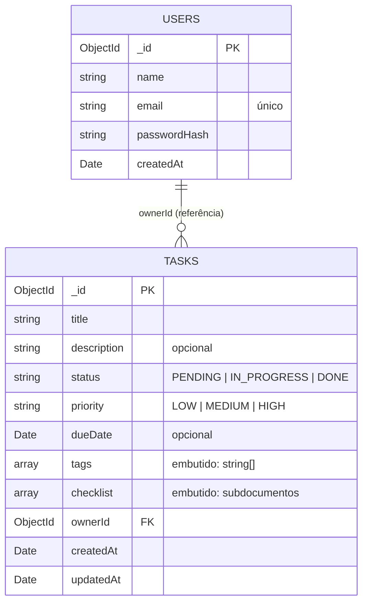

# Modelagem de dados — Task Manager em MongoDB

Documento de decisões sobre a persistência da API. Cobre por que o banco é orientado a documentos,
o que foi embutido e o que foi referenciado, quais perguntas do negócio a modelagem responde e
quais índices sustentam cada consulta.

## 1. Por que NoSQL/MongoDB neste domínio

O agregado central da aplicação é a **tarefa**. Ela é criada inteira, lida inteira e devolvida
inteira pela API — inclusive suas tags e seu checklist. Num modelo relacional isso viraria três
tabelas (`tasks`, `task_tags`, `task_checklist_items`) e todo `GET /api/tasks` passaria a ser um
join de três vias só para remontar algo que o cliente sempre consome junto. Em documentos, a mesma
leitura é um único `find` que já devolve o objeto pronto.

Os quatro pontos que pesaram na decisão:

- **Formato do agregado.** A fronteira transacional da aplicação é uma tarefa. Como toda escrita
  toca uma tarefa por vez, um documento único já dá atomicidade onde ela importa — sem precisar de
  transação distribuída entre tabelas.
- **Schema evolutivo.** `tags` e `checklist` variam muito de tarefa para tarefa: a maioria tem zero
  itens, algumas têm dez. Campos novos (prioridade, anexos, recorrência) tendem a aparecer ao longo
  do projeto. Num schema rígido cada um desses seria uma migration com `ALTER TABLE`; aqui o schema
  fica no Mongoose, versionado junto do código, e documentos antigos continuam legíveis.
- **Padrão de acesso.** Praticamente toda consulta começa em `ownerId` — listar, filtrar, resumir.
  Isso é um padrão de partição natural: os dados de um usuário ficam juntos, os índices compostos
  começam por `ownerId` e nenhuma query precisa varrer a coleção inteira.
- **Volume e escala.** A relação usuário→tarefas é 1:N de alta cardinalidade e cresce sem teto. O
  crescimento é em documentos independentes, que o Mongo distribui por `ownerId` sem que a
  aplicação mude.

### O que se perde

Ser honesto sobre o custo faz parte da decisão:

- **Transações multi-documento.** Criar um usuário e suas tarefas iniciais em um único passo
  atômico exige `session`/transação explícita, que só existe em replica set. Num relacional isso
  seria um `BEGIN/COMMIT` trivial.
- **Integridade referencial.** Não há `FOREIGN KEY`: nada no banco impede uma tarefa apontar para um
  `ownerId` de usuário já excluído. A garantia passa a ser responsabilidade da aplicação (no nosso
  caso, do `TaskService`, que só aceita o `ownerId` vindo do token verificado).
- **Consultas ad hoc entre coleções.** Relatórios que cruzam usuários e tarefas dependem de
  `$lookup`, que é mais limitado e mais caro que um join do planejador relacional.
- **Duplicação.** Tags são strings repetidas em cada documento. Renomear uma tag em massa seria um
  `updateMany`, não um `UPDATE` em uma linha de tabela de domínio.

O domínio é de agregados pequenos, lidos por dono e sem relatórios analíticos cruzados — o que se
perde é pouco usado aqui, e o que se ganha é usado a cada requisição.

## 2. Embedding vs. referência

| Dado | Decisão | Justificativa |
|---|---|---|
| `tasks.tags: string[]` | **Embutido** | Cardinalidade baixa (limite de 10), sempre lido junto da tarefa e sem atributo próprio além do nome. |
| `tasks.checklist: [{ title, done, createdAt }]` | **Embutido** (subdocumento sem `_id`) | Item de checklist não existe fora da tarefa, nunca é consultado sozinho e é limitado a 50 itens — o documento não cresce sem controle. |
| `tasks.ownerId → users._id` | **Referência** (`ObjectId` + `ref: 'User'`) | 1:N de alta cardinalidade e ciclo de vida independente: o usuário existe antes e depois das tarefas, e embutir tarefas no usuário estouraria o limite de 16 MB do documento. |
| `users.passwordHash` | **Embutido** | Atributo do próprio usuário, lido apenas no login. |

O critério aplicado foi o de sempre: embute o que é lido junto, tem cardinalidade limitada e não tem
consulta própria; referencia o que tem vida própria ou cresce sem teto.

## 3. Perguntas do negócio → consulta que as responde

| Pergunta | Consulta | Índice usado |
|---|---|---|
| Quais tarefas pendentes eu tenho? | `find({ ownerId, status: 'PENDING' })` | `{ ownerId: 1, status: 1 }` |
| Quais tarefas minhas vencem esta semana? | `find({ ownerId, dueDate: { $gte: hoje, $lte: fimDaSemana } })` | `{ ownerId: 1, dueDate: 1 }` |
| Quais tarefas tenho sobre um assunto? | `find({ ownerId, tags: 'estudo' })` | `{ tags: 1 }` (multikey) |
| Quantas tarefas tenho por status? | `aggregate([{ $match: { ownerId } }, { $group: { _id: '$status', count: { $sum: 1 } } }])` | `{ ownerId: 1, status: 1 }` |
| Quais são minhas tags mais usadas? | `aggregate([{ $match: { ownerId } }, { $unwind: '$tags' }, { $group: { _id: '$tags', count: { $sum: 1 } } }, { $sort: { count: -1 } }, { $limit: 5 }])` | `{ ownerId: 1, status: 1 }` no `$match` |
| Quantas tarefas estão atrasadas? | `countDocuments({ ownerId, dueDate: { $lt: agora }, status: { $ne: 'DONE' } })` | `{ ownerId: 1, dueDate: 1 }` |
| Existe usuário com este e-mail? | `findOne({ email })` | `{ email: 1 }` único |

As três últimas perguntas sobre tarefas são respondidas de uma vez só pelo endpoint
`GET /api/tasks/stats`, que usa um `$facet` para rodar os três sub-pipelines
(`$match` → `$group`/`$unwind`/`$sort`/`$limit`) em uma única ida ao banco — implementado em
[mongoose-task.repository.ts](../src/repositories/mongoose/mongoose-task.repository.ts).

## 4. Índices criados

| Índice | Coleção | Consulta que serve |
|---|---|---|
| `{ email: 1 }` único | `users` | Login e checagem de e-mail duplicado no cadastro; a unicidade também é a trava que devolve 409 em vez de criar duas contas. |
| `{ ownerId: 1 }` | `tasks` | Prefixo de toda consulta por dono; sustenta o `$match` inicial das agregações. |
| `{ ownerId: 1, status: 1 }` | `tasks` | `GET /api/tasks?status=PENDING` e a contagem por status — o filtro mais frequente da aplicação. |
| `{ ownerId: 1, dueDate: 1 }` | `tasks` | Agenda: vencimentos da semana e contagem de atrasadas; o segundo campo permite busca por faixa. |
| `{ tags: 1 }` | `tasks` | Índice multikey sobre o array embutido, para `GET /api/tasks?tag=estudo`. |

Todos os índices compostos começam por `ownerId` porque nenhuma consulta da aplicação cruza donos —
o prefixo elimina de saída os documentos dos outros usuários.

## 5. Diagrama



Formato real dos documentos:

```
users                             tasks
┌────────────────────────┐        ┌──────────────────────────────────────┐
│ _id:          ObjectId │◄───────│ ownerId:     ObjectId (ref: User)    │
│ name:         string   │  1:N   │ title:       string                  │
│ email:        string ⚷ │        │ description: string?                 │
│ passwordHash: string   │        │ status:      PENDING|IN_PROGRESS|DONE│
│ createdAt:    Date     │        │ priority:    LOW|MEDIUM|HIGH         │
└────────────────────────┘        │ dueDate:     Date?                   │
                                  │ tags:        ["estudo", "backend"]   │
   ⚷ = índice único               │ checklist:   [ ─────────────────┐    │
                                  │                { title, done,   │    │
                                  │                  createdAt }    │    │
                                  │              ] ◄── embutido ────┘    │
                                  │ createdAt:   Date                    │
                                  │ updatedAt:   Date                    │
                                  └──────────────────────────────────────┘
```

## 6. Como isso chega até a aplicação

O documento acima descreve apenas a camada de infraestrutura. Nenhuma camada acima do repositório
conhece `ObjectId`, `_id` ou `__v`: os mappers em
[src/repositories/mongoose/mappers/](../src/repositories/mongoose/mappers/) convertem documento em
entidade de domínio (`id: string`) na fronteira, e as entidades em
[src/domain/entities/](../src/domain/entities/) continuam sendo interfaces TypeScript puras. Por
isso os repositórios in-memory seguem funcionando como implementação alternativa da mesma interface.
